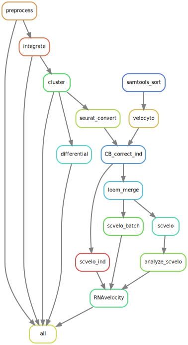

# cite_seq

Perform secondary analysis on CITE-Seq datasets using Seurat. Steps include pre-processing, individual clustering, sample integration, and group clustering. Due to the emphasis on secondary analysis in scRNA-Seq, there will be special instructions on how to run this pipeline. It is highly recommended to run this pipeline on SLURM cluster due to the heavy memory footprint - especially if there are many biological replicates and/or cells captured.

## 1. Run primary analysis with CellRanger

You should run your samples through [CellRanger](https://support.10xgenomics.com/single-cell-gene-expression/software/pipelines/latest/using/count)

## 2. Prepare your work environment

### Symlink the output of CellRanger to the working directory

```bash
# clone this repo into a new workding directory
git clone https://github.com/maxsonBraunLab/cite_seq.git

# cd into 'cite_seq' and make a new dir for output of cellranger
mkdir -p data/raw

# cd into 'data/raw' and symlink the sample's output folder
# the output folder should contain the following dir: `outs/filtered_feature_bc_matrix`
# `filtered_feature_bc_matrix` should contain barcodes, features, and matrix file.
ln -s /absolute/path/to/cellranger/sample1 .
ln -s /absolute/path/to/cellranger/sample2 .
ln -s /absolute/path/to/cellranger/sample3 .
```

After the files are symlinked, the raw data should be in the following format: `data/raw/{sample}/outs/filtered_feature_bc_matrix`

### Change the pipeline configuration

Edit the `config.yaml` file to fit your experiment. You will need to adjust different parameters as you go through the pipeline. For example, if you are running step 1 to preprocess the data, just fill out section 0 and 1. Continue to fill out the sections as you progress through the pipeline.

## Prepare the conda environment

Continue forward if you don't have a conda environment with a clean install of snakemake.

```bash
# while using base conda env, create your snakemake environment
conda install -c conda-forge mamba # installs into base env
mamba create -c conda-forge -c bioconda -n snakemake snakemake # installs snakemake into new env

conda activate snakemake
```

### Configure SLURM profile

Copy the entire slurm folder into your home directory ~/.config/snakemake and then delete the local copy.

## 3. Run the pipeline

You can run the pipeline using an interactive node like this:

```bash
# request interactive node
srun --cores=8 --mem=64G --time=24:00:00 --pty bash
conda activate snakemake

# invoke snakemake with 8 cores using predefined conda envs.
snakemake -j 8 --use-conda
```

Or submit batch jobs to the cluster like this:

```bash
snakemake -j 1 --use-conda --cluster-config cluster.yaml --profile slurm
```

### **SPECIAL INSTRUCTIONS**

This pipeline requires more user interaction than usual due to the subjective interpretation of scRNA-Seq data. Therefore it is best to run the pipeline one step at a time, check the reports, asses the results, and re-run the step again with new parameters. Please commit to remembering the following argument flags:

```bash
# dry run. this tells which rules will be run.
snakemake -j 1 --use-conda -np

# run the pipeline up until a rule (inclusive).
snakemake -j <cores> --use-conda <cluster_config_arguments> -U preprocess

# force re-run a rule. If this affects downstream rules, the later rules will be re-run again.
snakemake -j <cores> --use-conda <cluster_config_arguments> -R cluster
```

If you are new to snakemake or are experiencing problems, please read the [documentation](https://snakemake.readthedocs.io/en/stable/).

## Output

There will be one HTML report for each step (`data/reports`) and they are described below.

### 1 - preprocess

Samples are imported into Seurat objects. These sample's metadata are aggregated together and important QC metrics are plotted for filtering away doublets and dying cells. The script pulls from the `config.yaml` file to filter cells by mitochondrial content and number of features. After filtration, cell cycle regression (CCR) is performed and shown in section 7. The top row is before CCR, and the bottom row is after CCR. The Seurat objects are saved as a list into the output rds file.

### 2 - integrate

Common integration anchors are calculated in the datasets to create an integrated Seurat object. This integrated Seurat object amalgamates all the individual samples into one space and is useful for clustering and differential analysis.

### 3 - cluster

Each sample and integrated object will be clustered. We used clustree to parameter sweep the resolution parameter and also plotted variance and SD explained by principal component. In high-quality samples, these graphs should converge or reach an asymptote. 2D UMAPS, custom feature plots, ADT marker plots, and cluster proportions for integrated object are shown. 3D umaps colored by clusters and identity are in the `data/umaps` folder. Please re-run this step multiple times to get the right cluster resolution for your experiment!

### 4 - differential

There are 3 schemes for differential expression analysis:

1. FindAllMarkers = For each sample, find the DE genes at each cluster compared to all other clusters. Does not take into consideration the cell identity. `data/markers/FindAllMarkers`
2. FindConservedMarkers = For each sample at each cluster, find commonly-expressed genes between 2 identities. I would not look beyond the top 10 genes per cluster on this list. `data/markers/FindConservedMarkers`
3. FindMarkersIdent = loop through each cluster and do pairwise test between 2 conditions (wilcoxon). up and down genes are pushed through topGO. `data/markers/FindMarkersIdent`

## Methods



## References

[CITE-Seq](https://www.nature.com/articles/nmeth.4380)
